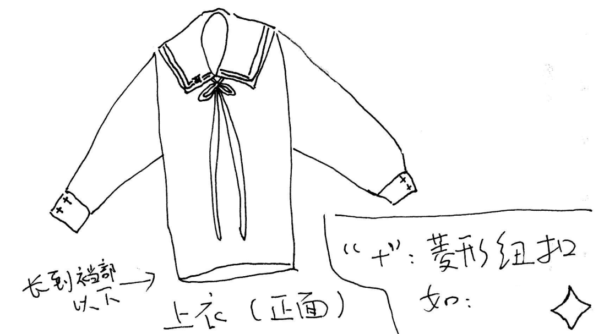
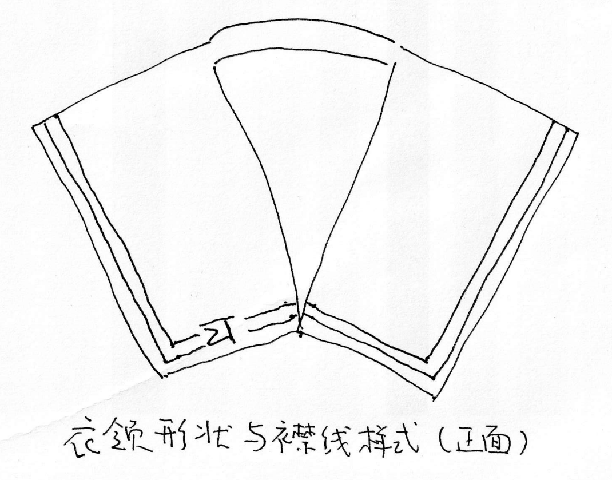
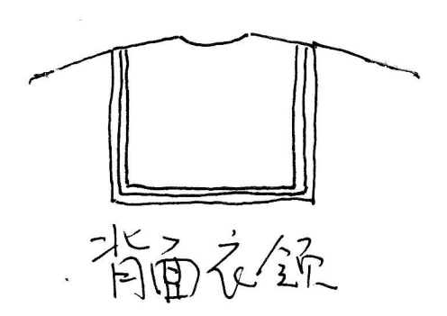
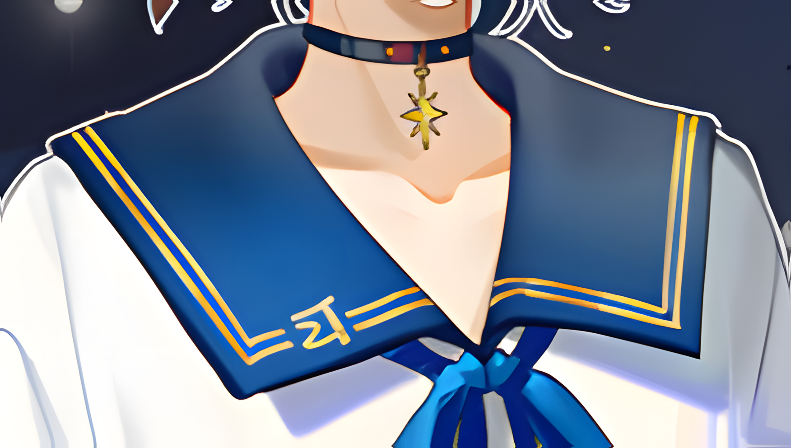
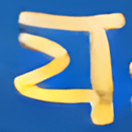
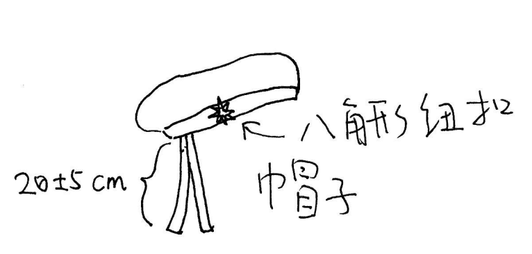
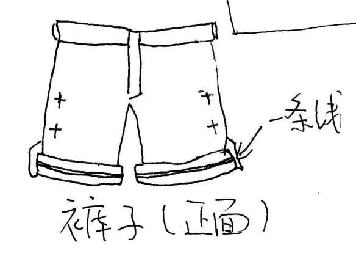
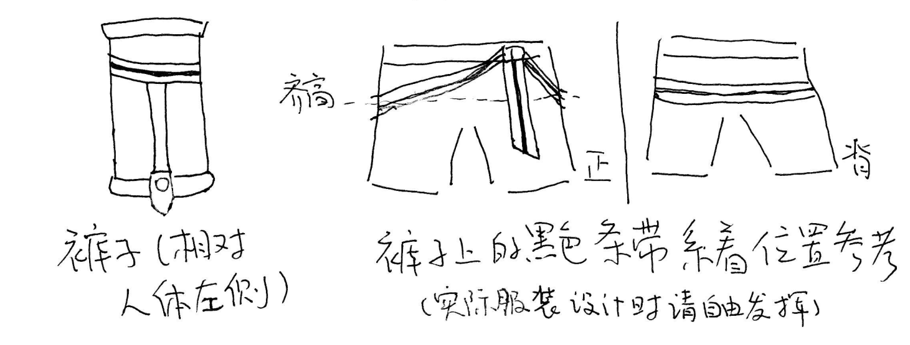
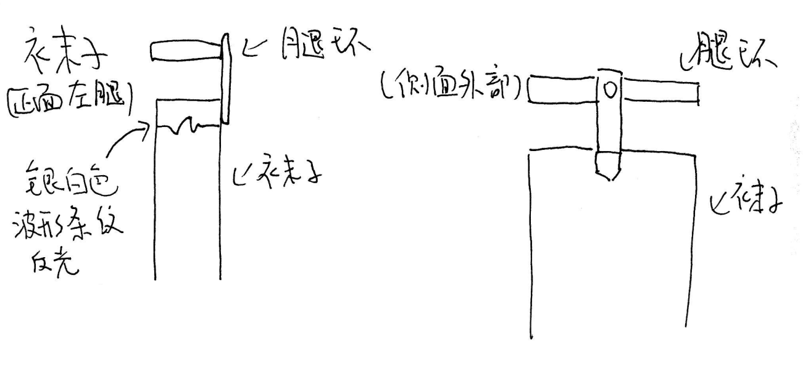

zhǐ
# 徵羽摩柯 2021 生贺服装逆向分析与设计

ver. 0.4

by leisquid

**此文档以 CC BY-SA 4.0 协议授权**

## 0. 声明

此文档仅为个人意见，不代表官方观点。

作者不具有服装设计知识。使用此文档来设计服装时，**请务必构思或沟通好实际服装的设计方式**。

找 cos 服定制店铺定制服装时，**请务必沟通好设计细节**！

此文档仅供参考，**实际设计时请以官方资料为准**（见附.1 章节）！

## 1. 大体设计

这是徵羽摩柯 2021 年以 “沙城” 为主题的生贺服装。因基于水手服的设计，且视觉上简洁明快，此服装深受角色爱好者及 coser 的喜爱。

此服装是基于男式水手服设计的服装，并加入了角色的个性化元素。

如定制 cos 服，可参考男士休闲服装、水手服或日式制服衬衣的款式或风格，建议按照水手服而不是 cos 服去设计或用料。整体上可设计得更宽松点而不必太修身，也不用过于按照 coser 的体型数据来设计。

## 2. 上身

### 2.1 上身服装

#### 2.1.1 整体设计

以**男式长袖水手服上衣**为基础。服装整体为白色，**偏宽松**。**衣服长度至裆部以下**。

#### 2.1.2 衣领

衣领为深蓝色方领，没有抹胸。

衣领形状为 “**角襟**” 或 “方领”。按照 [Nico 百科](https://dic.nicovideo.jp/t/a/%E3%82%BB%E3%83%BC%E3%83%A9%E3%83%BC%E6%9C%8D)的说法，严格来讲这不是学校制服的样式，而是亚文化的一种衍生形式。以下节选并翻译：

> 与其他类型的校服一样，很少有校服与真正的水手服一致。实际上许多校服都有自己的配色与形状，没有任何学校采用这种方领水手服作为校服。
>
> 此外，也有许多角色穿着水手服（如 VOCALOID 的镜音铃、连）。以旧帝国海军舰艇为原型的舰娘（按：舰 Colle）制服也多半是水手服。

襟线样式为金色二本，宽度为 8±1 mm 为宜；特别地，在衣领正面的左下方（穿着着角度的右下方）有角色的专属 logo。如下图。

logo 图案及位置尽量与官方设计一致。如下图。

#### 2.1.3 领巾

领巾为蓝色丝带，打结挂在衣领内，宽度为 13±2 mm 为宜。

如果为了不用每次穿衣时都要重新系丝带的话，建议可以把围住衣领内部的部分设计成松紧带，每次穿着时拉伸套入即可。

#### 2.1.4 袖口

袖口收紧，并配有两颗垂直布局的**菱形纽扣**。纽扣的形状为底面为菱形的四棱锥。

### 2.2 帽子

类似海军贝雷帽的风格。上部为白色，收口处帽檐为比衣领颜色更深的深蓝色。

中间配有**八角形**（六芒星？）的金色纽扣。

### 2.3 项圈

项圈为黑色皮质，正前方有金色八角形（六芒星？）的吊坠，左右两边相邻处有两颗金色小豆状小扣。见上 2.1.2 节中的图。

## 3. 下身

### 3.1 裤子

下身配有男式短裤，类似西装短裤的风格。整体为比衣领颜色更深的深蓝色。

裤腿处有卷起，并配有金色线条。裤腿底部往上靠外侧分别配有两颗垂直布局的菱形纽扣。纽扣（下图中以 “+” 号表示）的形状为**四芒星形**的装饰或纽扣。

腰部系有黑色状条带，类似帆布腰带，并配有金色线条。

### 3.2 袜子

**白色长袜**，长度不过膝。

每条腿的袜子上方（依然不过膝）各有条比衣领颜色更深的深蓝色的腿环，外侧有条状布料与长袜相连，连接处用袜夹夹住。

### 3.3 鞋子

男式棕黑色皮鞋。

## 附录

### 附.1 可参考的服装设计截图

前 2 张图为角色服装的主视图，请着重以这两张图为参考进行分析与设计，后几张图片可作参考。

### 附.2 参考资料

+ 仅使用现成材料制作的教程视频：<https://www.bilibili.com/video/BV11t42147xb/>

## 变更履历

### ver 0.4, \'24.2.28

+ 修改裤子上的装饰说明。

### ver 0.3, \'24.2.25

+ 经进一步分析后，完善衣领等处的设计描述。
+ 增加特别感谢、变更履历等章节。

### ver.0.2, \'24.2.15

+ 增加关于服装参考的提醒。

### ver 0.1, \'24.2.15

+ new

## 特别感谢

**[Hiroki Gong](https://space.bilibili.com/32721189)**、**[UMPMOK](https://space.bilibili.com/471489638)** 两位大佬参与本次服装的分析。
