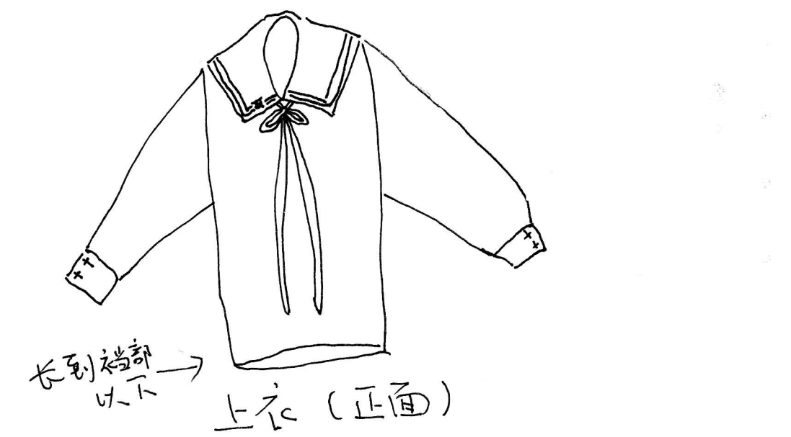
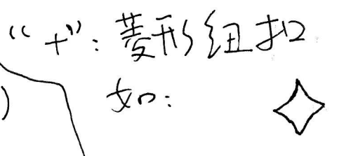
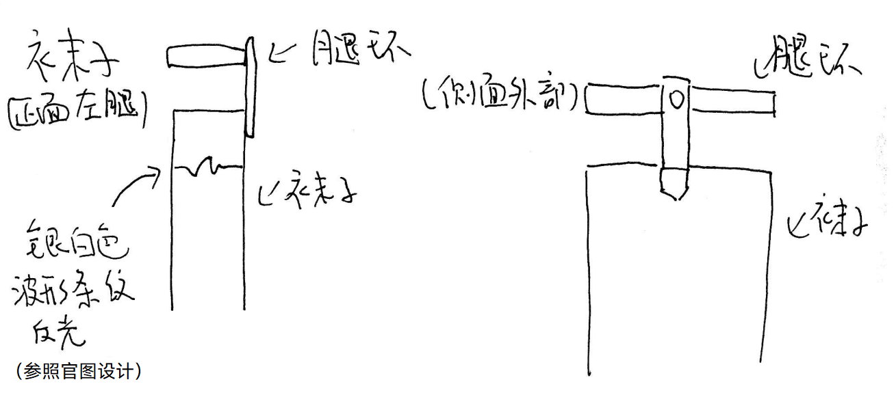
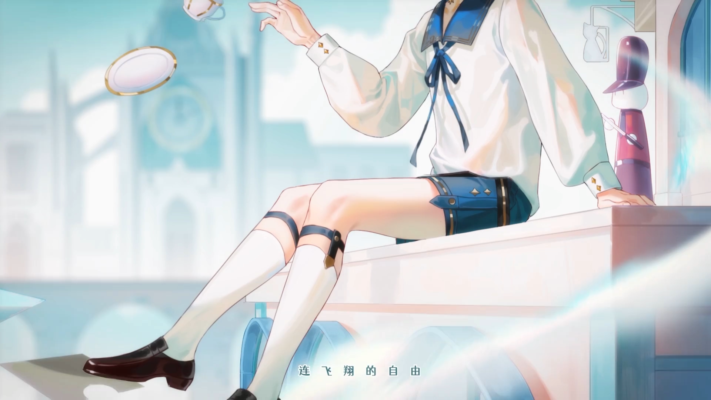

# 徵羽摩柯 2021 生贺服装逆向分析与设计

ver. 0.1

by leisquid

**此文档以 CC BY-SA 4.0 协议授权**

## 0. 声明

此文档仅为个人意见，不代表官方观点。

作者不具有服装设计知识。使用此文档来设计服装时，**请务必构思或沟通好实际服装的设计方式**。

找 cos 服定制店铺定制服装时，**请务必沟通好设计细节**！

## 1. 大体设计

此服装是基于男式水手服设计的服装。

如定制 cos 服，可根据以下建议定制服装：

+ 参考服装款式/风格

  - 男士休闲服装
  - 水手服
  - 日式制服衬衣

## 2. 上身

### 2.1 上身服装

以**男式长袖水手服上衣**为基础。服装整体为白色，**偏宽松**。**衣服长度至裆部以下**。

衣领为深蓝色方领，没有抹胸。

襟线样式为金色二本，宽度为 8±1 mm 为宜；特别地，在衣领正面的左下方（穿着着角度的右下方）有角色的专属 logo。如下图。

领巾为蓝色丝带，打结挂在衣领内，宽度为 13±2 mm 为宜。

袖口收紧，并配有两颗垂直布局的菱形纽扣。

### 2.2 帽子

类似贝雷帽的风格。上部为白色，收口处帽檐为比衣领颜色更深的深蓝色。

帽子顶端正上方可没有贝雷帽代表的 “小扣”，依设计难度而定。也可以做成，帽子上部为一整块布料缝合而成。

中间配有八角形的金色纽扣。

## 3. 下身

### 3.1 裤子

下身配有男式短裤，整体为比衣领颜色更深的深蓝色。

裤腿处有卷起，并配有金色线条。

腰部系有黑色状条带，并配有金色线条。

### 3.2 袜子

白色长袜，长度不过膝。

每条腿的袜子上方（依然不过膝）各有条比衣领颜色更深的深蓝色的腿环，外侧有条状布料与长袜相连。

### 3.3 鞋子

男式棕黑色皮鞋。

## 附录

### 附.1 可参考的服装设计截图

