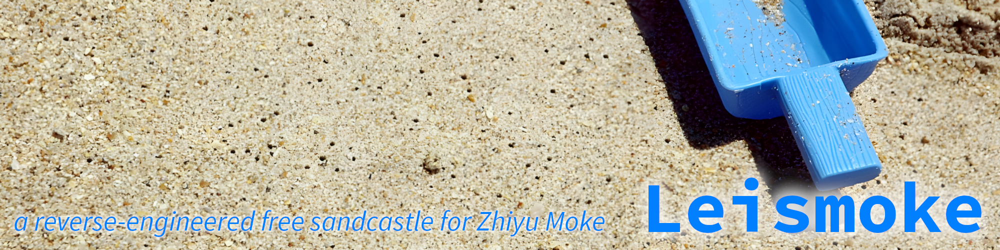

> 令蒲公英把正义传颂
>
> 使童话在楼宇间穿梭
>
> 我的沙城
>
> **不会坍缩**
>
> —— 徵羽摩柯《沙城》

## License

The Softwares, Source Codes and Scripts in Leismoke are all licensed under the GNU Affero General Public License version 3. See file [./LICENSE-for-softwares-and-codes.md](./LICENSE-for-softwares-and-codes.md)

The distirbuted items in Leismoke that are not Softwares, Source Codes or Scirpts, are all licensed under the CC BY-SA 4.0. See file [./LICENSE-for-non-softwares-or-codes.txt](./LICENSE-for-non-softwares-or-codes.txt)
