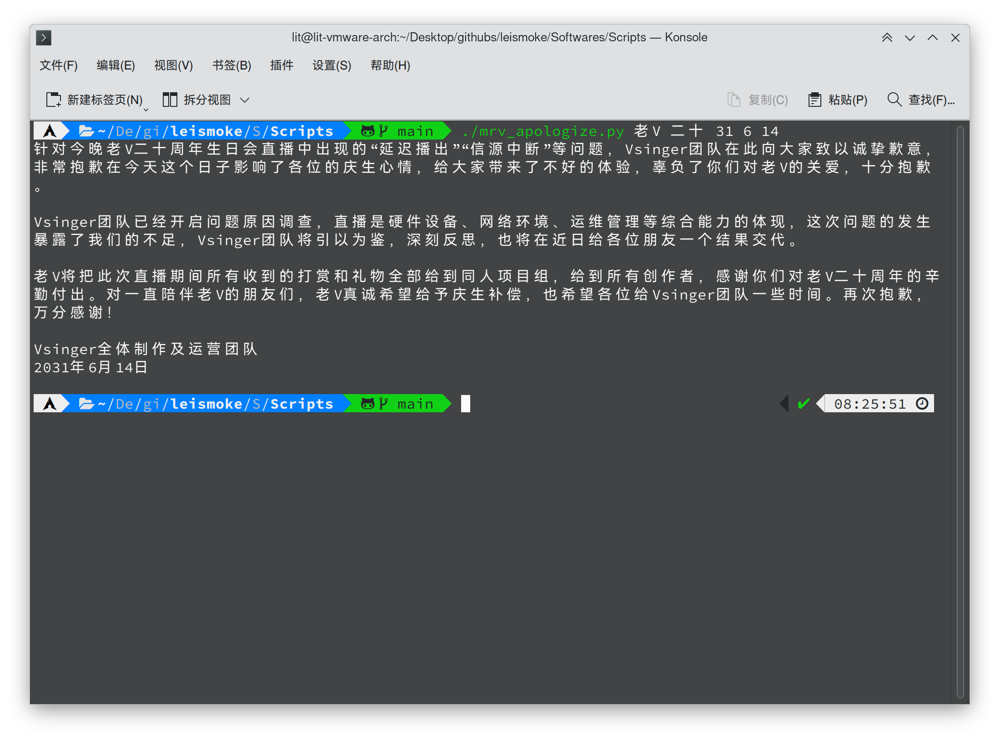

# Leismoke 中的脚本



## 前言

此目录中的脚本，通常为单个出现并且每个脚本文件实现比较简单的功能，所以不为其分别做详细介绍。需要用户一点点编程知识和终端操作经验来理解各个脚本的功能。

## 此目录下的脚本简介

| 名称 | 编程语言 | 功能 |
| ---- | ---- | ---- |
| mrv_apologize.py | Python 3 | 让老 V 为指定人物的生日会道歉 |
| mrv_apologize.sh | Shell (Bash) | 让老 V 为指定人物的生日会道歉 |
| snowflake.py | Python 3 | 从某中术运营得到的，并加入了详细注释的电子雪花 |
| snowflake_optimized.py | Python 3 | snowflake.py 的优化版 |

## 各编程语言的脚本的运行方式

> 友情提醒：对于 Shell 和 Python 脚本，`#` 开头的一行内容都是注释！在此目录下的此类脚本，以人类语言构成的注释以 `##` 开头，与被注释代码的开头的 `#` 区分开。

### Shell 脚本（兼容 Bash 语法）

前提：需要 GNU Bash 或兼容 Bash 的 Shell。不适用于 Windows 自带的 CMD 和 PowerShell。

可以通过下面任意一种方式运行脚本。以本目录下的 [mrv_apologize.sh](./mrv_apologize.sh) 为例。

**a)** 给这个脚本文件赋予可执行权限，并直接执行这个文件。

```sh
chmod a+x ./mrv_apologize.sh
./mrv_apologize.sh 老V 二十 31 6 14
```

**b)** 调用 bash 或其他兼容 bash 的 Shell 程序作为解释器执行脚本。

```sh
bash mrv_apologize.sh 老V 二十 31 6 14
```

### Python 3 脚本

前提：需要安装 Python 3 并自行补齐缺失的模块。

可以通过下面任意一种方式运行脚本。以本目录下的 [mrv_apologize.py](./mrv_apologize.py) 为例。

**a)** 给这个脚本文件赋予可执行权限，并直接执行这个文件。

  注意：
  
  1. 不适用于 Windows 自带的 CMD 和 PowerShell。
  2. 如通过这种方法无法运行，请参考下一种方法。

```sh
chmod a+x ./mrv_apologize.py
./mrv_apologize.py 老V 二十 31 6 14
```

**b)** 调用 Python 3 作为解释器执行脚本。

  此方法适用于任何可安装并使用 Python 的环境。

  注意：您的系统的 Python 解释器可能不叫作 `python3`，而叫做 `python` 等。请检查您的系统环境，并根据实际情况将下面的 `python3` 替换为 `python` 或其他名称。

```sh
python3 mrv_apologize.py 老V 二十 31 6 14
```

## 开源代码许可

此目录下的代码以 GNU Affero General Public License 授权。请在 GNU Affero General Public License 第 3 版或更新版本下使用、修改或发布代码。

详见 [../COPYING.md](../COPYING.md)。

---

leisquid

'24.3.19
